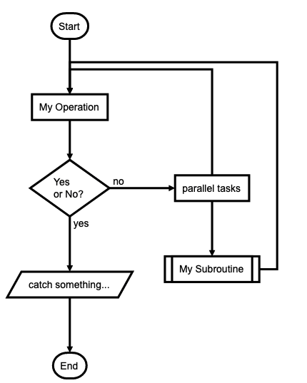

<!-- README.md is generated from README.Rmd. Please edit that file -->

## flowcharter

flowcharter is an R wrapper for
[flowchart.js](https://flowchart.js.org/), a JavaScript library for
drawing flowcharts.

## Installation

You can install the released version of flowcharter with:

``` r
# install.packages("devtools")
devtools::install_github("tgerke/flowcharter")
```

## Usage

This example reproduces the demo found on the
[flowchart.js](https://flowchart.js.org/) homepage.

``` r
library(flowcharter)

flowchart(
  "st=>start: Start:>http://www.google.com[blank]
e=>end:>http://www.google.com
op1=>operation: My Operation
sub1=>subroutine: My Subroutine
cond=>condition: Yes
or No?:>http://www.google.com
io=>inputoutput: catch something...
para=>parallel: parallel tasks

st->op1->cond
cond(yes)->io->e
cond(no)->para
para(path1, bottom)->sub1(right)->op1
para(path2, top)->op1"
)
```


